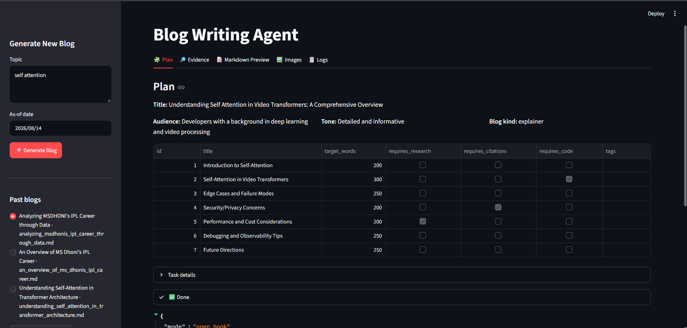
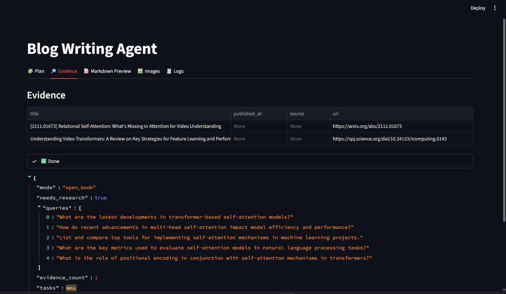
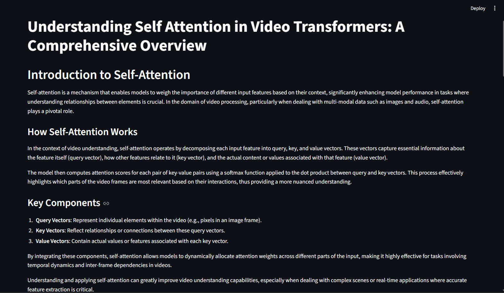
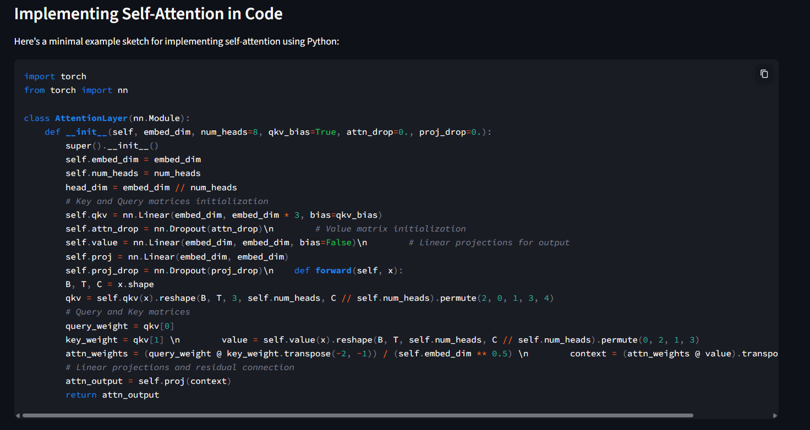
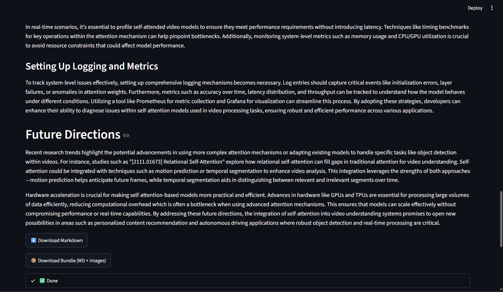
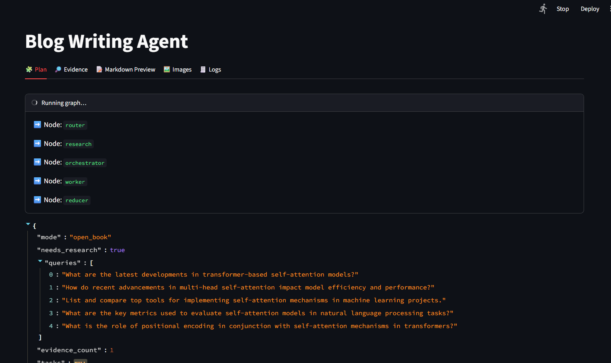

# 📝 Blog Writing Agent

An AI-powered **Multi-Agent Blog Writing System** built using **LangGraph**, **LangChain**, and **LLMs**. The application automatically researches a topic, creates a structured blog plan, collects evidence, generates high-quality content with citations, and exports the final blog in Markdown format.

---

## 🚀 Features

- 🤖 Multi-Agent Workflow using LangGraph
- 🔍 Automatic Research & Evidence Collection
- 📋 Intelligent Blog Planning
- ✍️ AI-generated Markdown Blog
- 📚 Research Paper & Citation Support
- 💻 Automatic Code Example Generation
- 📦 Download Blog as Markdown
- 🖼️ Download Blog Bundle (Markdown + Images)
- 🌙 Modern Streamlit UI

---

## 🛠️ Tech Stack

- Python
- LangGraph
- LangChain
- OpenAI / Gemini / Compatible LLM
- Tavily Search
- Streamlit
- Markdown
- Arxiv Research APIs

---

# 🏗️ Architecture

```
              User Input
                   │
                   ▼
             Router Agent
                   │
          Needs Research?
          ┌────────┴────────┐
          │                 │
         Yes               No
          │                 │
          ▼                 ▼
   Research Agent       Planner
          │
          ▼
   Orchestrator Agent
          │
          ▼
      Worker Agents
          │
          ▼
      Reducer Agent
          │
          ▼
     Final Blog Output
```

---
# 📸 Screenshots

## Dashboard

Generate a new blog by providing the topic and execution date.



---

## Multi-Agent Planning

The planner creates the blog outline, target word count, research requirements, citations, and execution tasks.



---

## Research Evidence

Displays the research papers and trusted sources collected before generating the blog.



---

## Generated Blog Preview

Preview of the AI-generated blog in Markdown format.



---

## Final Output

Complete generated blog with code examples, download options, and final content.



---

## LangGraph Execution Flow (Optional)

Shows the execution flow of the multi-agent architecture including Router, Research, Orchestrator, Worker, and Reducer nodes.



# ⚙️ Workflow

1. User enters blog topic.
2. Router decides whether research is required.
3. Research Agent searches trusted sources.
4. Planner creates blog outline.
5. Worker Agents generate each section.
6. Reducer combines all sections.
7. Markdown Preview is generated.
8. User downloads the final blog.

---

# 📂 Project Structure

```
Blog-Writing-Agent/
│
├── app.py
├── graph.py
├── agents/
│   ├── router.py
│   ├── planner.py
│   ├── research.py
│   ├── worker.py
│   └── reducer.py
│
├── prompts/
├── utils/
├── screenshots/
│   ├── dashboard.png
│   ├── plan.png
│   ├── evidence.png
│   ├── blog_preview.png
│   ├── code_generation.png
│   └── final_output.png
│
├── requirements.txt
└── README.md
```

---

# ▶️ Installation

```bash
git clone https://github.com/yourusername/blog-writing-agent.git

cd blog-writing-agent

pip install -r requirements.txt

streamlit run app.py
```

---

# 📌 Future Improvements

- Image Generation using AI
- SEO Optimization
- Multi-language Blog Support
- WordPress Publishing
- Human-in-the-loop Editing
- RAG-based Knowledge Base
- Multi-LLM Support

---

# 👨‍💻 Author

**Vinay Choudhary**

- GitHub: https://github.com/Vinay3606
- LinkedIn: https://www.linkedin.com/in/vinay-choudhary-3a6286288

---

## ⭐ If you found this project useful, don't forget to Star the repository!
